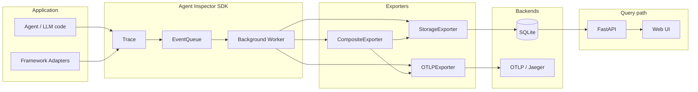
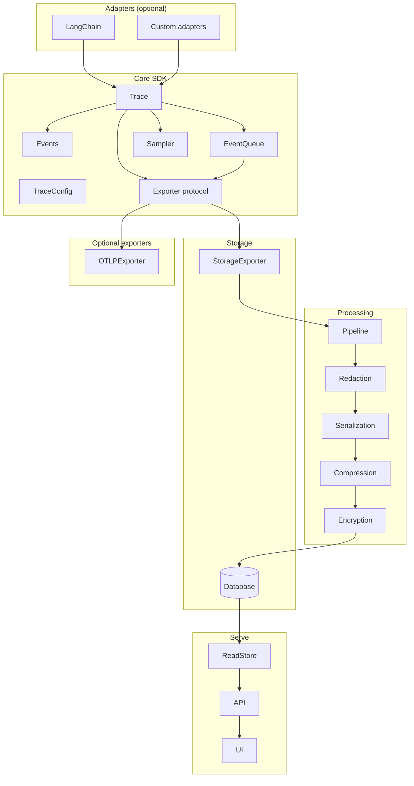
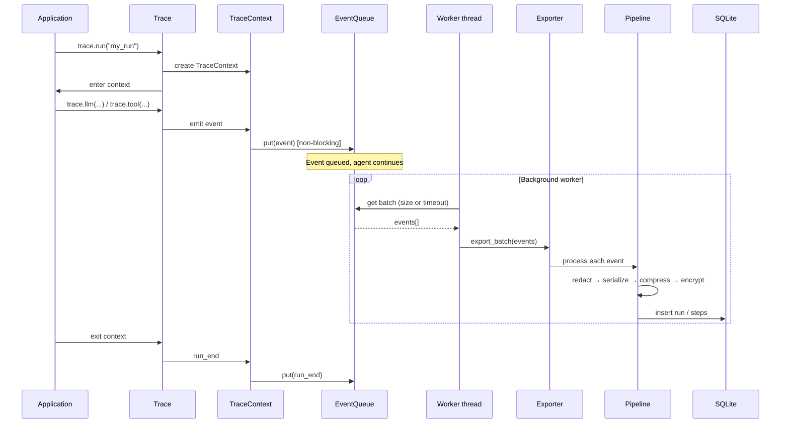
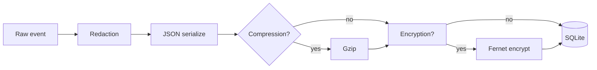

<div align="center">

# 🔍 Agent Inspector

**Framework-agnostic observability for AI agents**

A lightweight, non-blocking tracing system for monitoring and debugging AI agent reasoning, tool usage, and execution flow.

[](https://www.python.org/downloads/)
[](LICENSE)
[]()

</div>

---

## ⚡ Get started (60 seconds)

```bash
pip install ai-agent-inspector
# or from source: git clone <repo> && cd ai-agent-inspector && pip install -e .
```

```python
from agent_inspector import trace

with trace.run("my_first_trace"):
    trace.llm(model="gpt-4", prompt="Hi", response="Hello!")
    trace.final(answer="Done.")
```

```bash
agent-inspector server   # or: python -m agent_inspector.cli server
```

Open **http://localhost:8000/ui/** to see the run. For configuration, examples, and API details, read on.

---

## 📋 Table of Contents

- [Overview](#overview)
- [Features](#features)
- [Installation](#installation)
- [Quick Start](#quick-start)
- [Architecture](#architecture)
- [Configuration](#configuration)
- [Usage Examples](#usage-examples)
- [API Documentation](#api-documentation)
- [Framework Adapters](#framework-adapters)
- [Development](#development)
- [Contributing](#contributing)
- [License](#license)

---

## Overview

**Agent Inspector** answers the question: *"Why did my agent behave this way?"*

Unlike traditional logging or tracing tools, Agent Inspector is designed specifically for AI agents with:

- **Agent-first semantics** - Tracks reasoning, decisions, and tool orchestration
- **Framework agnostic** - Works with LangChain, AutoGen, custom agents, and more
- **Non-blocking** - Never impacts agent performance (<1ms overhead)
- **Secure by default** - Automatic redaction, compression, and encryption
- **Local-first** - No SaaS required, all data stays on your machine
- **Simple UI** - Visual timeline for understanding agent behavior

### What Makes It Different

Traditional tools model systems as function calls and spans. Agent Inspector models:
- 🤖 **LLM decisions** - Why did the agent choose this tool?
- 🔧 **Tool execution** - What arguments were passed? What was the result?
- 📖 **Memory operations** - What did the agent read/write?
- ❌ **Failure modes** - Where did the agent get stuck or fail?
- ✅ **Final outcomes** - What was the final answer?

---

## Features

### Core tracing SDK
- **Context manager API** – `with trace.run("run_name"):` wraps agent execution; all events are tied to that run.
- **Event emission** – `trace.llm()`, `trace.tool()`, `trace.memory_read()`, `trace.memory_write()`, `trace.error()`, `trace.final()`; optional `trace.emit(event)` for custom event types (`EventType.CUSTOM`).
- **Nested runs** – Multiple `trace.run()` blocks can be nested (e.g. orchestrator + specialist); parent/child is tracked via `parent_event_id`.
- **Active context** – `trace.get_active_context()` returns the current run’s context; works in both **sync and async** (asyncio) via `contextvars`.
- **Global trace** – `get_trace()` / `set_trace(trace)` for default instance or testing; module-level `trace` proxy.

### Sampling and backpressure
- **Sampling** – `TraceConfig.sample_rate` (0.0–1.0) and `only_on_error`; deterministic hash-based default; optional **pluggable `Sampler`** via `Trace(sampler=...)`.
- **Non-blocking queue** – Events are queued with `put_nowait`; a background worker batches and flushes to the exporter so the hot path never blocks.
- **Drain on shutdown** – On `shutdown()`, the worker drains the queue and flushes remaining events so nothing is dropped at exit.
- **Critical-event backpressure** – Optional `TraceConfig.block_on_run_end` and `run_end_block_timeout_ms`; when set, `run_end` is queued with a blocking put (up to timeout) so it is not dropped when the queue is full.

### Extensibility
- **Exporter protocol** – Implement `Exporter` (initialize, export_batch, shutdown) and pass to `Trace(exporter=...)`; default is `StorageExporter` (SQLite).
- **CompositeExporter** – Fan-out to multiple exporters: `Trace(exporter=CompositeExporter([db_exporter, http_exporter]))`.
- **Sampler protocol** – Implement `Sampler.should_sample(run_id, run_name, config)` and pass to `Trace(sampler=...)` for custom sampling (e.g. by user, tenant).
- **Custom events** – Use `EventType.CUSTOM` and `TraceContext.emit(event)` or `Trace.emit(event)` for custom `BaseEvent` subclasses.

### Data pipeline
- **Redaction** – Configurable `redact_keys` and `redact_patterns`; applied before serialization.
- **Serialization** – Compact JSON for storage.
- **Compression** – Optional gzip (configurable level) before storage.
- **Encryption** – Optional Fernet symmetric encryption at rest (`encryption_enabled`, `encryption_key`).

### Storage
- **SQLite** – WAL mode for concurrent access; runs and steps tables; indexes on run_id and timestamp.
- **Pruning** – CLI `prune --retention-days N` and optional `--vacuum`; API/DB support for retention.
- **Backup** – CLI `backup /path/to/backup.db` for full DB copy.
- **Export to JSON** – **API** `GET /v1/runs/{run_id}/export` returns run metadata + timeline with decoded event data; **CLI** `agent-inspector export <run_id> [--output file.json]` and `agent-inspector export --all [--limit N] [--output file.json]` for backup or migration.

### API
- **FastAPI** – REST API with OpenAPI docs at `/docs` and `/redoc`.
- **Endpoints** – Health, list runs (with filters), get run, get run timeline, get run steps, get step data, **export run**, stats; optional API key auth and CORS.
- **List runs filters** – `limit`, `offset`, `status`, `user_id`, `session_id`, `search`, **`started_after`**, **`started_before`** (timestamps in ms since epoch) for date-range queries.

### UI
- **Web interface** – Three-panel layout: run list (filters, search), timeline, detail view; dark mode; real-time updates for running runs; served at `/ui/`.

### CLI
- **Commands** – `init`, `server`, `stats`, `prune`, `vacuum`, `backup`, **`export`** (single run or `--all`), `config`, `--version`.
- **Profiles** – `config --profile production|development|debug`; env `TRACE_PROFILE`.

### Optional integrations
- **LangChain** – `pip install ai-agent-inspector[langchain]`; `enable_langchain()` for automatic tracing of LLM and tool calls.
- **OpenTelemetry OTLP** – `pip install ai-agent-inspector[otel]`; `OTLPExporter(endpoint=...)` sends events as OTLP spans to Jaeger, Tempo, Grafana, etc.

### Configuration
- **Presets** – Production, development, debug (sample rate, compression, encryption, log level).
- **Environment variables** – All main options (sampling, queue, redaction, encryption, DB path, API, UI, logging, **block_on_run_end**, **run_end_block_timeout**) can be set via `TRACE_*` env vars.
- **Code** – `TraceConfig` in code; `set_config(config)` for global default.

---

## Installation

### Requirements

- Python 3.9 or higher
- pip or another package manager

### Install from PyPI

The PyPI package is **`ai-agent-inspector`** (distinct from the existing `agent-inspector` project on PyPI). After install, the CLI is still `agent-inspector` and imports are `from agent_inspector import ...`.

```bash
pip install ai-agent-inspector
```

### Install from Source

```bash
git clone https://github.com/koladilip/ai-agent-inspector.git
cd ai-agent-inspector
pip install -e .
```

### Optional Dependencies

```bash
# For LangChain adapter
pip install "ai-agent-inspector[langchain]"

# For development
pip install "ai-agent-inspector[dev]"
```

---

## Quick Start

### 1. Initialize Agent Inspector

```bash
agent-inspector init
```

This creates a default configuration and initializes the SQLite database.

### 2. Start Tracing in Your Code

```python
from agent_inspector import trace

# Wrap your agent execution in a trace context
with trace.run("my_agent"):
    # Your agent code here
    trace.llm(
        model="gpt-4",
        prompt="What is the capital of France?",
        response="The capital of France is Paris."
    )
    
    trace.tool(
        tool_name="search",
        tool_args={"query": "capital of France"},
        tool_result="Paris"
    )
    
    trace.final(answer="The capital of France is Paris.")
```

### 3. Start the API Server

```bash
agent-inspector server
```

### 4. View Traces in the UI

Open your browser to: **http://localhost:8000/**  
Root redirects to **/ui/**.

---

## Architecture

Agent Inspector is built around explicit interfaces so each layer can evolve independently.

### High-level system view



### Component layers



### Event flow (sequence)

From application code to storage: events are emitted synchronously into a queue, then processed asynchronously by a worker that batches and exports.



### Data pipeline (storage path)

Events written to SQLite pass through the processing pipeline before persistence.



### SDK Core
- `Trace` provides the context manager API (`trace.run(...)`) and event emission.
- Events are immutable dictionaries serialized by the processing pipeline.
- Events flow into an `Exporter` which handles delivery.

### Exporters
- The SDK depends on the `Exporter` interface.
- `StorageExporter` implements it using the database + pipeline.
- Alternative exporters can be plugged in without changing the SDK.

### Storage
- SQLite with WAL mode for concurrent access.
- Runs and steps are stored separately for efficient queries.

### API & UI
- API depends on a `ReadStore` interface to query runs and steps.
- UI is served as static assets under `/ui/static`.

---

## Configuration

### Configuration Presets

Agent Inspector comes with three configuration presets:

#### Production
```bash
agent-inspector config --profile production
```
- Sample rate: 1%
- Compression: Enabled
- Encryption: Enabled
- Log level: WARNING

#### Development
```bash
agent-inspector config --profile development
```
- Sample rate: 50%
- Compression: Enabled
- Encryption: Disabled
- Log level: INFO

#### Debug
```bash
agent-inspector config --profile debug
```
- Sample rate: 100%
- Compression: Disabled
- Encryption: Disabled
- Log level: DEBUG

### Environment Variables

Configure Agent Inspector using environment variables:

```bash
# Presets
export TRACE_PROFILE=development

# Sampling
export TRACE_SAMPLE_RATE=0.5
export TRACE_ONLY_ON_ERROR=false

# Queue & Batch
export TRACE_QUEUE_SIZE=1000
export TRACE_BATCH_SIZE=50
export TRACE_BATCH_TIMEOUT=1000

# Redaction
export TRACE_REDACT_KEYS="password,api_key,token"
export TRACE_REDACT_PATTERNS="\\b\\d{3}-\\d{2}-\\d{4}\\b"

# Encryption
export TRACE_ENCRYPTION_ENABLED=true
export TRACE_ENCRYPTION_KEY=your-secret-key-here

# Storage
export TRACE_DB_PATH=agent_inspector.db
export TRACE_RETENTION_DAYS=30

# API
export TRACE_API_HOST=127.0.0.1
export TRACE_API_PORT=8000
export TRACE_API_KEY_REQUIRED=false
export TRACE_API_KEY=your-api-key

# UI
export TRACE_UI_ENABLED=true
export TRACE_UI_PATH=/ui

# Processing
export TRACE_COMPRESSION_ENABLED=true
export TRACE_COMPRESSION_LEVEL=6

# Logging
export TRACE_LOG_LEVEL=INFO
export TRACE_LOG_PATH=agent_inspector.log
```

### Custom Configuration

Create a custom configuration in code:

```python
from agent_inspector import TraceConfig, set_config

config = TraceConfig(
    sample_rate=1.0,  # Trace all runs
    only_on_error=False,
    redact_keys=["password", "api_key", "secret"],
    redact_patterns=[
        r"\b\d{3}-\d{2}-\d{4}\b",  # SSN
        r"\b\d{4}[-\s]?\d{4}[-\s]?\d{4}[-\s]?\d{4}\b",  # Credit card
    ],
    encryption_enabled=False,
    compression_enabled=True,
    compression_level=6,
    queue_size=1000,
    batch_size=50,
    db_path="custom_inspector.db",
    retention_days=30,
)

set_config(config)
```

---

## Usage Examples

### Basic Agent Tracing

```python
from agent_inspector import trace

def search_flights_agent(user_query):
    with trace.run("flight_search", user_id="user123"):
        # Agent decides which tool to use
        trace.llm(
            model="gpt-4",
            prompt=f"User: {user_query}. Which tool should I use?",
            response="Use the search_flights tool."
        )
        
        # Tool execution
        trace.tool(
            tool_name="search_flights",
            tool_args={"query": user_query},
            tool_result={
                "flights": [
                    {"airline": "Delta", "price": "$350"},
                    {"airline": "United", "price": "$320"},
                ]
            }
        )
        
        # Agent processes results
        trace.llm(
            model="gpt-4",
            prompt=f"Found 2 flights. Which should I recommend?",
            response="Recommend United for $320, it's cheaper."
        )
        
        # Final answer
        trace.final(
            answer="I recommend United Airlines for $320. It's the cheapest option."
        )

# Run the agent
search_flights_agent("Find flights from SFO to JFK")
```

### Real Agent Example (OpenAI-compatible)

This example makes real LLM calls and runs multiple scenarios.

```bash
cp .env.example .env
```

Set these in `.env`:
- `OPENAI_BASE_URL`
- `OPENAI_API_KEY`
- `OPENAI_MODEL`

Run a single question:
```bash
python examples/real_agent.py "What is 13 * (7 + 5)?"
```

Run the full scenario suite:
```bash
python examples/real_agent.py --suite
```

### With LangChain (Automatic)

```python
from langchain.agents import initialize_agent, Tool, AgentType
from langchain.llms import OpenAI
from agent_inspector.adapters import enable_langchain

# Initialize your LangChain agent
llm = OpenAI(temperature=0)
tools = [
    Tool(name="search", func=search_flights, description="Search for flights")
]
agent = initialize_agent(tools, llm, agent=AgentType.ZERO_SHOT_REACT_DESCRIPTION)

# Use with automatic tracing
with enable_langchain(run_name="langchain_flight_agent") as callbacks:
    result = agent.run("Find flights from SFO to JFK")
    print(result)
```

That's it! All LLM calls, tool calls, and agent actions are automatically traced.

### Error Handling

```python
from agent_inspector import trace

with trace.run("error_demo"):
    try:
        # Successful operation
        trace.llm(
            model="gpt-4",
            prompt="What is 2+2?",
            response="4"
        )
        
        # Tool that fails
        trace.tool(
            tool_name="broken_tool",
            tool_args={"input": "test"},
            tool_result="Error: Connection timeout"
        )
        
        # Log the error
        trace.error(
            error_type="ConnectionError",
            error_message="Tool failed to connect",
            critical=False
        )
        
        # Continue with fallback
        trace.tool(
            tool_name="fallback_tool",
            tool_args={"input": "test"},
            tool_result="success"
        )
        
    except Exception as e:
        # Log unexpected errors
        trace.error(
            error_type=type(e).__name__,
            error_message=str(e),
            critical=True
        )
        raise
```

### Nested Agents

```python
from agent_inspector import trace

# Main agent
with trace.run("planning_agent", user_id="user123") as main_ctx:
    trace.llm(
        model="gpt-4",
        prompt="User wants to book a flight. Should I delegate?",
        response="Yes, delegate to booking agent."
    )
    
    # Sub-agent (nested)
    with trace.run("booking_agent", session_id="booking_456"):
        trace.tool(
            tool_name="book_flight",
            tool_args={"flight_id": "UA123"},
            tool_result={"status": "confirmed", "confirmation": "CONF-12345"}
        )
        
        trace.final(answer="Flight booked successfully!")
    
    # Main agent continues
    trace.final(answer="I've booked your flight. Confirmation: CONF-12345")
```

### Memory Operations

```python
from agent_inspector import trace

with trace.run("memory_agent"):
    # Read from memory
    trace.memory_read(
        memory_key="user_preferences",
        memory_value={"preferred_airline": "Delta", "seat": "window"},
        memory_type="key_value"
    )
    
    # Write to memory
    trace.memory_write(
        memory_key="last_search",
        memory_value={"query": "SFO to JFK", "timestamp": 1234567890},
        memory_type="key_value",
        overwrite=True
    )
    
    trace.final(answer="I found your preferences and remembered your search.")
```

---

## API Documentation

Once you start the API server, visit:

- **Swagger UI**: http://localhost:8000/docs
- **ReDoc**: http://localhost:8000/redoc

### Main Endpoints

#### Health Check
```
GET /health
```

#### List Runs
```
GET /v1/runs
  ?limit=100
  &offset=0
  &status=completed
  &user_id=user123
  &search=flight
```

#### Get Run Details
```
GET /v1/runs/{run_id}
```

#### Get Run Timeline
```
GET /v1/runs/{run_id}/timeline
  ?include_data=true
```

#### Get Run Steps
```
GET /v1/runs/{run_id}/steps
  ?limit=50
  &offset=0
  &event_type=llm_call
```

#### Get Step Data
```
GET /v1/runs/{run_id}/steps/{step_id}/data
```

#### Statistics
```
GET /v1/stats
```

---

## Framework Adapters

### LangChain

Install the optional dependency:

```bash
pip install "ai-agent-inspector[langchain]"
```

Automatic tracing:

```python
from agent_inspector.adapters import enable_langchain
from langchain.agents import initialize_agent

# Create agent
agent = initialize_agent(tools, llm, agent=AgentType.ZERO_SHOT_REACT_DESCRIPTION)

# Trace automatically
with enable_langchain() as callbacks:
    result = agent.run("Your query here")
```

Manual callback handler:

```python
from agent_inspector.adapters import get_callback_handler

# Get callback handler
callbacks = [get_callback_handler()]

# Use with LangChain chains
chain = LLMChain(llm=llm, prompt=prompt)
result = chain.run("Your query", callbacks=callbacks)
```

### Creating Custom Adapters

Create a new adapter by extending `BaseCallbackHandler` (for LangChain-like frameworks) or by using the Trace SDK directly:

```python
from agent_inspector import Trace, get_trace

class CustomAdapter:
    def __init__(self, trace: Trace = None):
        self.trace = trace or get_trace()
    
    def on_llm_call(self, model, prompt, response):
        """Handle LLM calls in your framework."""
        context = self.trace.get_active_context()
        if context:
            context.llm(model=model, prompt=prompt, response=response)
    
    def on_tool_call(self, tool_name, args, result):
        """Handle tool calls in your framework."""
        context = self.trace.get_active_context()
        if context:
            context.tool(tool_name=tool_name, tool_args=args, tool_result=result)

# Use your adapter
with trace.run("custom_agent"):
    adapter = CustomAdapter()
    
    # Your framework code
    adapter.on_llm_call("gpt-4", "Hello", "Hi there!")
```

---

## Development

### Setup Development Environment

```bash
# Clone the repository
git clone https://github.com/koladilip/ai-agent-inspector.git
cd ai-agent-inspector

# Install in development mode
pip install -e ".[dev]"

# Run tests
pytest

# Run with coverage
pytest --cov=agent_inspector --cov-report=html
```

### Project Structure

```
agent_inspector/
├── core/              # Core tracing SDK
│   ├── config.py     # Configuration management
│   ├── events.py     # Event model
│   ├── interfaces.py # Exporter and ReadStore protocols
│   ├── queue.py      # Non-blocking queue
│   └── trace.py      # Main Trace SDK
├── processing/         # Data processing pipeline
│   └── pipeline.py   # Redaction, compression, encryption
├── storage/           # SQLite database
│   ├── database.py   # Database operations
│   └── exporter.py   # Storage exporter implementation
├── api/               # FastAPI REST API
│   └── main.py       # API server
├── ui/                # Web interface
│   ├── app.py        # UI router + static mounting
│   ├── static/       # CSS/JS assets
│   └── templates/    # HTML templates
├── adapters/           # Framework integrations
│   └── langchain_adapter.py
└── cli.py             # Command-line interface
```

### Running Examples

```bash
# Basic tracing example
python examples/basic_tracing.py

# Real agent example (OpenAI-compatible)
python examples/real_agent.py "What is 13 * (7 + 5)?"

# Start API server
python -m agent_inspector.cli server

# View statistics
python -m agent_inspector.cli stats

# Prune old data
python -m agent_inspector.cli prune --retention-days 30 --vacuum
```

### Code Quality

```bash
# Format code
black agent_inspector/ examples/ tests/

# Lint code
flake8 agent_inspector/

# Type check
mypy agent_inspector/
```

### Releasing

Releases are automated with [Release Please](https://github.com/googleapis/release-please). Use **conventional commits** so Release Please can open and update a Release PR:

- **feat:** – new feature (bumps minor version)
- **fix:** – bug fix (bumps patch version)
- **feat!:** or **BREAKING CHANGE:** – breaking change (bumps major version)

When you merge the Release PR, a tag is created and the [publish workflow](.github/workflows/publish.yml) publishes to PyPI (OIDC).

**First release:** Release Please only creates Release PRs for commits *since* the latest release. If you have no release yet, create the initial tag so it has a baseline: `git tag v1.0.0 && git push origin v1.0.0`. After that, new `feat:`/`fix:` commits will get Release PRs.

---

## Contributing

We welcome contributions! Here's how to get started:

### Reporting Issues

1. Check existing issues on GitHub
2. Create a new issue with:
   - Clear description of the bug or feature
   - Steps to reproduce (for bugs)
   - Expected vs actual behavior
   - Environment details (Python version, OS, etc.)

### Submitting Pull Requests

1. Fork the repository
2. Create a feature branch:
   ```bash
   git checkout -b feature/my-feature
   ```
3. Make your changes
4. Run tests:
   ```bash
   pytest
   ```
5. Ensure code quality:
   ```bash
   black agent_inspector/
   flake8 agent_inspector/
   ```
6. Commit your changes
7. Push to your fork
8. Create a pull request

### Development Guidelines

- Follow PEP 8 style guide
- Add tests for new features
- Update documentation
- Keep changes minimal and focused

---

## CLI Commands

```bash
# Initialize Agent Inspector
agent-inspector init [--profile production|development|debug]

# Start API server
agent-inspector server [--host HOST] [--port PORT]

# View statistics
agent-inspector stats

# Prune old traces
agent-inspector prune [--retention-days N] [--vacuum]

# Vacuum database
agent-inspector vacuum

# Create backup
agent-inspector backup /path/to/backup.db

# View configuration
agent-inspector config [--show] [--profile PROFILE]

# Show version
agent-inspector --version
```

---

## Performance

Agent Inspector is designed for minimal overhead:

| Operation | Target | Typical |
|-----------|--------|---------|
| Queue event | <100μs | ~50μs |
| Create event | <1ms | ~200μs |
| Compress data | N/A | 5-10x reduction |
| API latency | <100ms | ~50ms |
| UI load | <500ms | ~200ms |

### Memory Usage

- Queue: ~10KB (1000 events × 10 bytes/event)
- Background thread: ~5MB (batch processing)
- Database: Varies with trace volume

---

## Security

### Default Protections

- 🔒 **Redaction** - Sensitive keys redacted by default
- 🗜️ **Compression** - Reduces storage footprint
- 🔐 **Encryption** - Fernet encryption (optional)
- 📊 **Sampling** - Reduces data collection volume
- 💾 **Local-First** - No data leaves your machine

### Best Practices

1. **Never log API keys** - Use redaction or environment variables
2. **Enable encryption** - For production deployments
3. **Use sampling** - Reduce overhead in high-traffic scenarios
4. **Review traces** - Regularly audit what's being captured
5. **Prune old data** - Set appropriate retention policies

---

## License

This project is licensed under the MIT License - see the [LICENSE](LICENSE) file for details.

---

## Support

- 📖 [Documentation](https://github.com/koladilip/ai-agent-inspector#readme)
- 🐛 [Issue Tracker](https://github.com/koladilip/ai-agent-inspector/issues)
---

## Acknowledgments


---

<div align="center">

**Made with ❤️ by Dilip Kola**

[⭐ Star on GitHub](https://github.com/koladilip/ai-agent-inspector)
</div>
